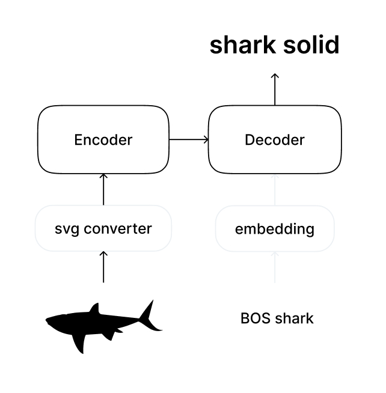
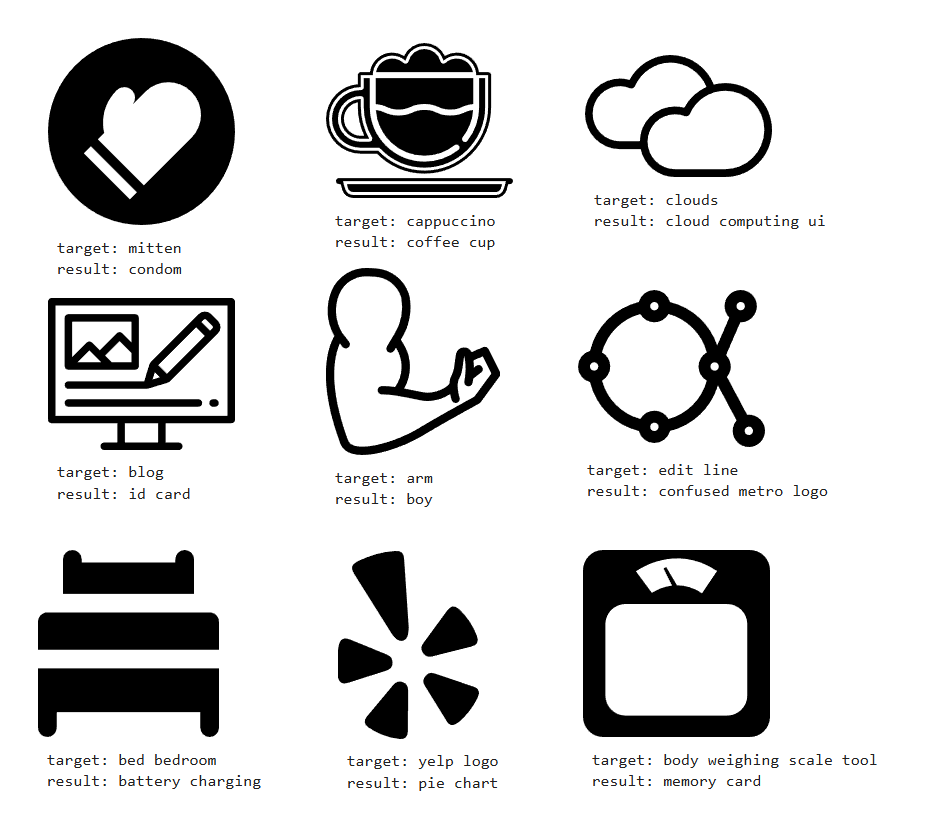

# SVG-to-Text

Этот проект реализует модель глубокого обучения, которая преобразует иконки SVG в текстовые описания. Модель основана на сочетании CNN (свёрточной нейронной сети) и Transformer, обученной в течение 6 часов на одном GPU, используя половину набора данных [SVG Icons](https://www.kaggle.com/datasets/victorcondino/svgicons).

## Архитектура

Архитектура состоит из следующих ключевых компонентов:

1. **Преобразование пути SVG**: Пути SVG преобразуются в относительные векторы с использованием кастомного [svg_converter](https://github.com/grafstor/svg-to-text/tree/main/svg_converter).
2. **Извлечение признаков**: 1D свёрточная нейронная сеть (Conv1d) извлекает признаки из этих векторов.
3. **Transformer**: Извлечённые признаки передаются через Transformer, который функционирует как автоэнкодер для генерации окончательных текстовых описаний.

## Примеры тестирования

Вот несколько примеров вывода модели на тестовых образцах:

