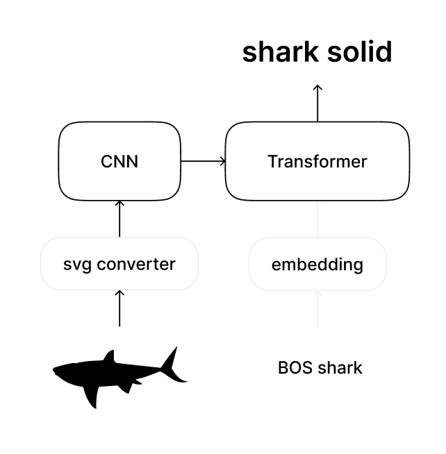

# SVG-to-Text

This project implements a deep learning model that converts SVG icons into textual descriptions. The model is based on a combination of a CNN (Convolutional Neural Network) and a Transformer, trained for 6 hours on a single GPU using half of the [SVG Icons dataset](https://www.kaggle.com/datasets/victorcondino/svgicons).

## Architecture

The architecture consists of the following key components:

1. **SVG Path Conversion**: SVG paths are converted into relative vectors using the custom [svg_converter](https://github.com/grafstor/svg-to-text/tree/main/svg_converter).
2. **Feature Extraction**: A 1D Convolutional Neural Network (Conv1d) extracts features from these vectors.
3. **Transformer**: The extracted features are passed through a Transformer, which functions as an autoencoder to generate the final textual descriptions.

## Test Samples

Here are some examples of the model's output on test samples:

